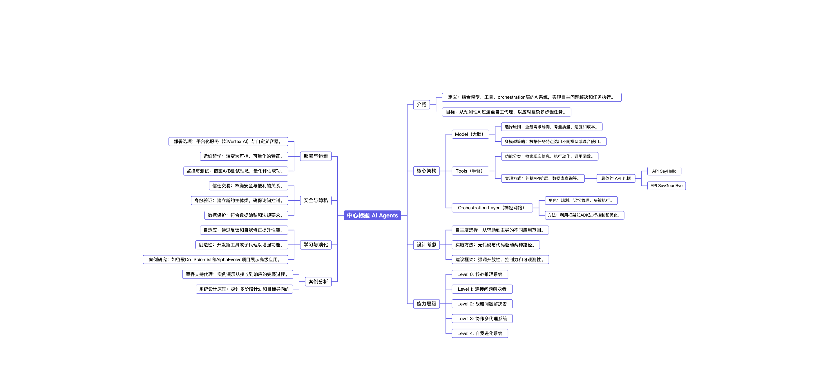

# Mindmark - Obsidian 思维导图插件

一款功能强大的 Obsidian 思维导图插件，支持将 Markdown 列表和多级标题渲染为交互式思维导图。



## ✨ 特色功能

### 🎨 两种渲染模式
- **Outline View（大纲视图）**：从左到右的水平布局，适合展示层级结构
- **Radial Mind Map（放射状思维导图）**：左右对称的放射布局，适合展示中心主题

### 📝 智能内容识别
- **多级标题模式**：自动识别 `##`、`###` 等多级标题，标题下的内容作为备注
- **列表模式**：支持 `-` 或 `*` 开头的缩进列表，`#` 作为根标题

### 🎯 交互体验
- **点击展开/折叠**：点击节点或圆圈即可展开或折叠子节点
- **备注展示**：支持 Markdown 格式的备注内容，点击 📝 图标在右侧面板查看
- **缩放和平移**：支持鼠标拖拽平移、滚轮缩放（可配置）
- **一键复制**：点击 📷 按钮将思维导图复制为高清 PNG 图片

### 🎨 视觉设计
- **专业配色**：深蓝色线条和文字，简洁优雅
- **自适应布局**：自动居中显示，支持任意尺寸
- **平滑动画**：面板滑入滑出，操作流畅

## 📦 安装方法

### 手动安装
1. 下载插件并解压
2. 将文件夹重命名为 `obsidian-mindmap`
3. 复制到 Obsidian 插件目录：
   - **macOS**: `~/Library/Application Support/obsidian/plugins/`
   - **Windows**: `%APPDATA%\obsidian\plugins\`
   - **Linux**: `~/.config/obsidian/plugins/`
4. 在 Obsidian 设置 → 第三方插件中启用 "Mindmark"

### 开发安装
```bash
git clone https://github.com/iFaceless/obsidian-mindmap.git
cd obsidian-mindmap
npm install
npm run build
```

## 🚀 使用方法

### 基础用法

在 Obsidian 笔记中创建代码块，使用 `mindmap` 作为语言标识符：

````markdown
```mindmap
- 核心架构
  - Model（大脑）
    - 选择原则：业务需求导向
    - 多模型策略
  - Tools（手臂）
    - 检索现实信息
    - 执行动作
  - Orchestration Layer
    - 规划
    - 记忆管理
```
````

### 多级标题模式

使用 Markdown 多级标题创建思维导图，标题下的内容会自动识别为备注：

````markdown
```mindmap
## 技术
### 基础知识
基础知识是**长期主义**的投资，短期内看不到明显收益，但决定了职业天花板。

#### 算法
刷题策略与心得：
- **LeetCode Hot 100** 是最核心的题库，优先搞定
- 常见题型：`*` 表示高频
  - 1. 链表：`反转链表`、`环形链表`、`合并 K 个有序链表`
  - 2. 二叉树：`层序遍历`、`路径总和`、`最近公共祖先`
  - 3. 动态规划：`背包问题`、`最长递增子序列`、`编辑距离`
  - 4. DFS/BFS：`岛屿数量`、`课程表`、`矩阵最短路径`
- 面试技巧：**先讲思路，再写代码，最后分析复杂度**
```
````

### 添加备注

在列表模式下，使用 `#` 标题后的内容作为根节点，子节点使用 `-` 或 `*`：

````markdown
```mindmap
# Day_1_v4

## 介绍
- 定义：结合模型、工具、orchestration层的AI系统
- 目标：从预测性AI过渡至自主代理

## 核心架构
- Model（大脑）
  - 选择原则：业务需求导向
  - 多模型策略：根据任务特点选用不同模型
- Tools（手臂）
  - 功能分类：检索现实信息、执行动作
- Orchestration Layer（神经网络）
  - 角色：规划、记忆管理、决策执行
```
````

## 🎮 交互操作

| 操作 | 功能 |
|------|------|
| **点击节点文字** | 展开或折叠子节点 |
| **点击空心圆** | 展开或折叠子节点 |
| **点击 📝 图标** | 在右侧面板显示备注内容 |
| **点击画布空白处** | 隐藏备注面板 |
| **鼠标拖拽** | 平移画布 |
| **鼠标滚轮** | 缩放画布（需在设置中启用） |
| **点击 +/- 按钮** | 放大/缩小 |
| **点击 🎯 按钮** | 重置缩放和位置 |
| **点击 📷 按钮** | 复制为 PNG 图片 |
| **下拉选择** | 切换渲染模式 |

## ⚙️ 设置选项

- **Default render mode**：选择默认渲染模式（Outline View / Radial Mind Map）
- **Enable mouse wheel zoom**：启用鼠标滚轮缩放（默认关闭）

## 📸 渲染效果


## 💡 使用技巧

1. **快速切换模式**：使用控制面板的下拉菜单快速切换渲染模式
2. **导出图片**：点击 📷 按钮将思维导图复制为高清 PNG，可直接粘贴到文档中
3. **备注管理**：在多级标题模式下，标题下的所有内容都会作为备注，支持完整的 Markdown 格式
4. **智能识别**：插件会自动识别内容类型，无需手动选择模式

## 🔧 开发

```bash
# 安装依赖
npm install

# 开发模式（自动重新构建）
npm run dev

# 生产构建
npm run build
```

## 📝 更新日志

### v1.0.0
- ✨ 支持两种渲染模式：Outline View 和 Radial Mind Map
- ✨ 智能内容识别：多级标题模式和列表模式
- ✨ 右侧备注面板，支持 Markdown 渲染
- ✨ 一键复制为高清 PNG 图片
- ✨ 点击节点展开/折叠功能
- ✨ 缩放和平移支持
- 🎨 专业的视觉设计

## 📄 许可证

MIT License

## 🤝 贡献

欢迎提交 Issue 和 Pull Request！

## 📧 联系方式

- GitHub: [iFaceless/obsidian-mindmap](https://github.com/iFaceless/obsidian-mindmap)